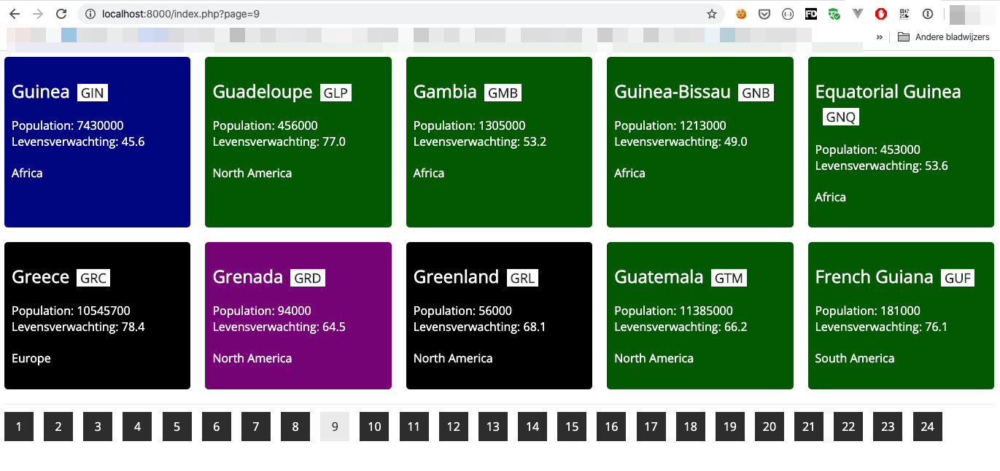
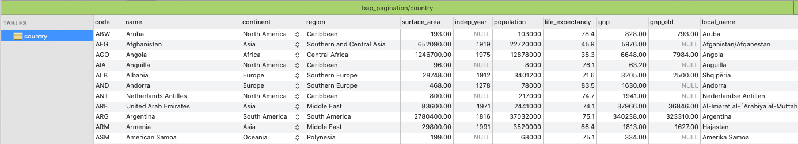

# BAP Pagination

In deze opdracht ga je proberen om zelf een werkende pagination (paginering) te maken.

``Pagination is het verdelen van veel gegevens over meerdere pagina's``

### Importeer de database
- Importeer eerst het bestand `bap_pagination.sql` in je database server (via phpMyAdmin bijvoorbeeld)
- Stel de juiste connectie gegevens in in `includes/config.php`

### Aan de slag
De code werkt nog niet, die moet werkend gemaakt worden door jou.

1. Lees de code in `index.php` eerst.
2. Volg de code en bekijk alle regels waar een `TODO` staat.
3. Op de plek van de `TODO` moet je zelf code schrijven, een berekening maken of een SQL query schrijven.

### Hulp
Bedenk goed hoe je ook alweer tot de juiste gegevens komt, [gebruik dit ter ondersteuning](http://bap.mediadeveloper.amsterdam/the-wall/pagination/).

- Totaal aantal rijen in een table tellen
- Aantal pagina's uitrekenen
- De juiste start (OFFSET) en aantal (LIMIT) opgeven in je query
- Bekijk goed wat de functie `getCountries()` teruggeeft en hoe je die informatie kunt gebruiken
- *Vraag hulp aan anderen waar nodig*

---
#### Commit en push alles naar Github, ook als je nog niet klaar bent

Veel succes!

---
### Voorbeeld eindresultaat

### Database

Dit zit er in de database

